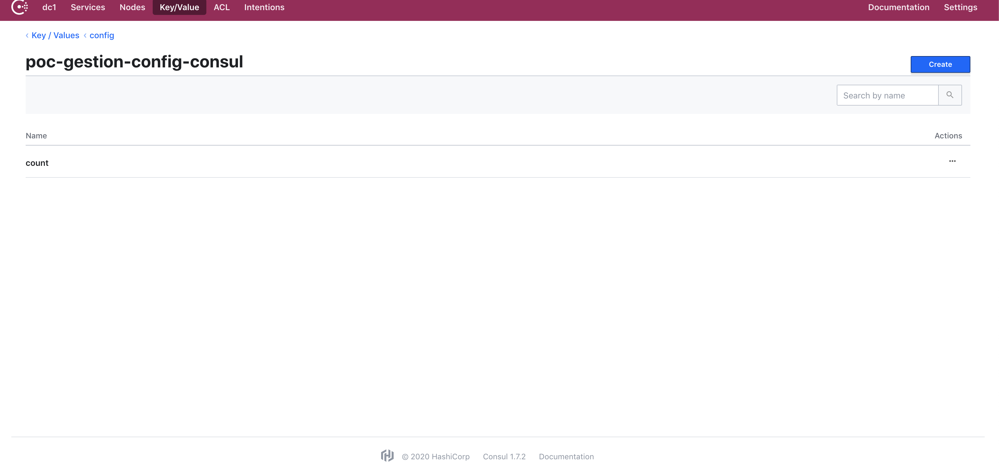

# poc-gestion-config-consul

### Run Consul 


- Add below dependencies in pom.xml

```xml
        	 <dependency>
                       <groupId>org.springframework.cloud</groupId>
                       <artifactId>spring-cloud-starter-consul-config</artifactId>
                       <version>2.1.5.RELEASE</version>
                   </dependency>
```

- Start consul as docker containers

```
$ docker run -d --rm --name consul -p 8500:8500 consul
```

By default, Consul runs on port 8500, but in the products, most likely, you want to change both the address and the port. While opening in the browser http://localhost:8500 we will see a fairly simple and nice interface, as well as our connected application.

- View Consul [url](http://localhost:8500)

- Create application configuration k/v : Key/Value -> create -> config/ -> create -> poc-gestion-config-consul/ ...

Consul looks for the value of the variables in "/config/${spring.application.name}". In our case, you need to create the "/config/poc-gestion-config-consul/count" key with some new value, for example, "New value".



### Start App 

```sh
mvn spring-boot:run
```

- View App [url](http://localhost:8080/count)

### Dynamic configuration

Now you can change the key value at any time and it will be automatically applied the next time it is called. But for this to work, you need to add an @RefreshScope annotation to our controller. After that, changing the values of variables works without restarting the application.


```log
2020-03-27 16:36:31.026  INFO 26426 --- [nio-8080-exec-1] o.s.web.servlet.DispatcherServlet        : Completed initialization in 18 ms
2020-03-27 16:37:08.825  INFO 26426 --- [TaskScheduler-1] trationDelegate$BeanPostProcessorChecker : Bean 'org.springframework.retry.annotation.RetryConfiguration' of type [org.springframework.retry.annotation.RetryConfiguration$$EnhancerBySpringCGLIB$$67ff3b91] is not eligible for getting processed by all BeanPostProcessors (for example: not eligible for auto-proxying)
2020-03-27 16:37:08.908  INFO 26426 --- [TaskScheduler-1] b.c.PropertySourceBootstrapConfiguration : Located property source: [BootstrapPropertySource {name='bootstrapProperties-config/poc-gestion-config-consul/'}, BootstrapPropertySource {name='bootstrapProperties-config/application/'}]
2020-03-27 16:37:08.910  INFO 26426 --- [TaskScheduler-1] o.s.boot.SpringApplication               : No active profile set, falling back to default profiles: default
2020-03-27 16:37:08.922  INFO 26426 --- [TaskScheduler-1] o.s.boot.SpringApplication               : Started application in 0.184 seconds (JVM running for 47.897)
2020-03-27 16:37:08.957  INFO 26426 --- [TaskScheduler-1] o.s.c.e.event.RefreshEventListener       : Refresh keys changed: [count]

```
